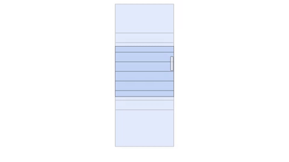

## Virtual Scroll Sample (React virtualized)

Như chúng ta đã biết khi trình duyệt web tải một lượng dữ liệu xuống để hiển thị (ví dụ 10000 bản ghi) sẽ rất chậm, đơ, hiệu năng thấp ảnh hưởng tới khá nhiều trải nghiệm người dùng (UX). 

Chính vì thế là người ta đã sinh ra phương pháp cải thiện đó là virtual scroll, chỉ render những phần trong view point (khung nhìn) của người dùng. Thay vì hiển thị hết 10000 phần tử HTML thì chỉ cần hiển thị hơn chục phần tử. 

Khi ta cuộn thì 1 số phần tử sẽ bị loại khỏi DOM để tối ưu và thanh cuộn sinh ra là thanh cuộn ảo. Như thế cho dù chúng ta có hiển thị nhiều dữ liệu như nào đi nữa ứng dụng vẫn sẽ mượt mà :))


Ảnh minh họa:



## CÀI ĐẶT

    npm install

## SỬ DỤNG

    npm start

Đoạn code ví dụ sử dụng react virtualized hiển thị list danh sách lên đến 10000 phần tử:

```javascript
const rowCount = 10000;
const rowHeight = 50;
const listHeight = 500;

const App = () => {
  const list = Array(rowCount)
    .fill()
    .map((val, idx) => {
      return {
        id: idx,
        image: "http://via.placeholder.com/40",
        text: loremIpsum({
          count: 1,
          units: "sentences",
          sentenceLowerBound: 4,
          sentenceUpperBound: 8,
        }),
      };
    });

  const renderRow = ({ index, key, style }) => {
    return (
      <div key={key} style={style} className="row-list">
        <div className="image">
          
        </div>
        <div className="content">
          <div>ID: {list[index].id}</div>
          <div>{list[index].text}</div>
        </div>
      </div>
    );
  };

  return (
    <div className="App">
      <AutoSizer disableWidth>
        {() => {
          return (
            <div>
              <div>
                <List
                  width={800}
                  height={listHeight}
                  rowHeight={rowHeight}
                  rowRenderer={renderRow}
                  rowCount={list.length}
                  overscanRowCount={3}
                  style={{ borderBottom: "1px solid #eee" }}
                />
              </div>
            </div>
          );
        }}
      </AutoSizer>
    </div>
  );
};
export default App;

```
